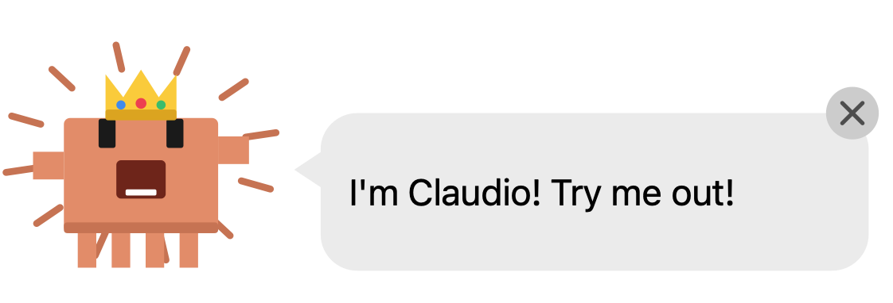
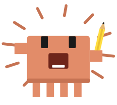
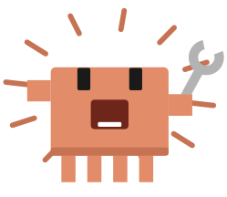
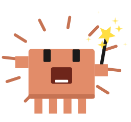
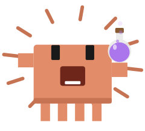
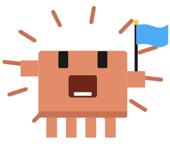
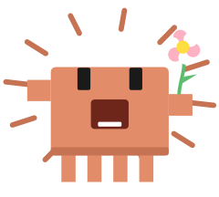
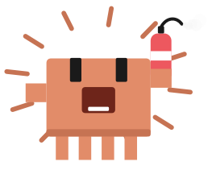
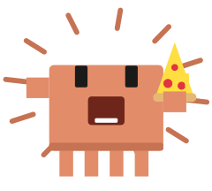
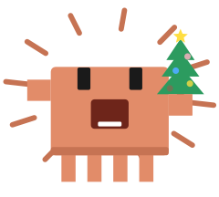

# Claudio

A small animated desktop notifier for [Claude Code](https://claude.com/claude-code) on macOS.



When Claude finishes a task or needs input, a banner slides in at the top right of the screen, like a macOS notification. A little orange mascot shouts silently, holds a random prop, and a speech bubble says what happened ("All 24 tests pass!", "Need your OK for Bash!").

- **Done** (Claude finished): the mascot jumps happily and holds something celebratory.
- **Ask** (Claude needs input or permission): the mascot shakes and holds something attention-grabbing.
- **One banner per session**: when several sessions finish, their banners stack one under the other, oldest on top. When one closes, the ones below slide up. A session's new banner replaces its own previous one.
- **Click to jump back**: clicking the mascot or the bubble brings the session that finished to the front, then closes the banner. Clicking the X only closes it. See [Jumping to the session](#jumping-to-the-session).
- **Dismissed** when the user clicks it, sends a new prompt in that session, or Claude resumes working in it; otherwise after 5 minutes. Activity in other Claude Code sessions leaves it alone.
- **Quiet while waiting**: no banner when Claude only pauses for a timer or a background task.

**Claude Code only.** Claudio is started by Claude Code hooks, so it works wherever Claude Code runs on your Mac: the `claude` CLI, the VS Code and JetBrains extensions, and the **Code** tab of Claude Desktop. It does not work with regular Claude chat (in Claude Desktop, on claude.ai or on the phone), which has no hooks. See [Claude Desktop](#claude-desktop) for VM and cloud sessions.

**Contents**

- [Requirements](#requirements)
- [Install](#install)
  - [With Homebrew](#with-homebrew) · [From the repo](#from-the-repo) · [Both ways](#both-ways)
- [Preview](#preview)
  - [Running the app directly](#running-the-app-directly)
- [How it works](#how-it-works)
- [Jumping to the session](#jumping-to-the-session)
- [Haiku captions](#haiku-captions)
- [Troubleshooting](#troubleshooting)
  - [Claude Desktop](#claude-desktop)
- [Mascots](#mascots)
- [Props](#props)
- [Animations](#animations)
- [Project layout](#project-layout)

## <a id="requirements"></a>Requirements 

- macOS
- Xcode Command Line Tools (`swiftc`): `xcode-select --install` (Homebrew already needs them)
- `jq`: built into macOS 15 and later; on older versions, `brew install jq`
- Claude Code, logged in, for task-specific bubble lines (optional: without it, Claudio uses canned lines). See [Haiku captions](#haiku-captions) for where Claudio looks for it.

## <a id="install"></a>Install 

### With Homebrew

```sh
brew update && brew install nappozord/tap/claudio && claudio-setup
```

- `brew update` makes Homebrew see the latest version. On its own, `brew install` refreshes taps at most once a day, so it could still see an old one.
- `brew install` builds Claudio and installs it. If an older version is installed, it upgrades it.
- `claudio-setup` is the one extra step, because Homebrew does not let a formula edit your home folder. It registers four hooks in `~/.claude/settings.json`, keeping every other setting (a backup is written to `settings.json.claudio-backup`).

Run `claudio-setup` once. Later updates need only `brew update && brew upgrade nappozord/tap/claudio`.

To remove it:

```sh
claudio-uninstall
brew uninstall claudio
```

### From the repo

```sh
./install.sh        # or: make install
```

This builds the app, copies it to `~/.claude/claudio/`, and registers the same four hooks. Re-running it is safe; it replaces its own entries, including the Homebrew ones (and `claudio-setup` replaces the repo ones). To remove it: `./uninstall.sh` (or `make uninstall`).

### Both ways

- Setup ends with one test call to Haiku and prints `Haiku captions: on (...)` or `off: <reason>`. `--no-check` skips that call.
- Already-open Claude Code sessions pick up the hooks after `/hooks` is opened once, or after a restart. The hooks apply to every local Claude Code session: CLI, VS Code extension, and the desktop app's Code tab.

## <a id="preview"></a>Preview 

Four settings: **`PROP` picks the held prop**, **`ACCESSORY` picks a worn one** (crown included), **`MASCOT` picks which one of the fleet** (see [Mascots](#mascots)), and **`MODE` picks the mood** (`done` or `ask`).

```sh
make preview PROP=pizza                     # a specific prop
make preview ACCESSORY=crown                # the rare crown (no prop held)
make preview ACCESSORY=sunglasses PROP=pizza  # worn alongside a held prop
make preview MASCOT=yellow                  # a specific mascot, instead of the random pick
make preview PROP=bell MODE=ask             # a prop in the "ask" mood
make preview                                # random prop and mascot, "done" mood
make preview MODE=ask                       # random prop and mascot, "ask" mood
make preview TEXT="All 24 tests pass"       # a fake message, sent through Haiku like a real one
make props                                  # every name PROP accepts
make accessories                            # every name ACCESSORY accepts
make mascots                                # every name MASCOT accepts
```

- **`PROP`** takes the internal names listed by `make props` (`icecream`, `popper`, `sign`...), not the names in the [Props](#props) table. **`ACCESSORY`** takes the names from `make accessories` (`crown`, `sunglasses`, `partyhat`, `nose`). **`MASCOT`** takes the names from `make mascots`. `make preview` stops and lists the valid names if one is unknown.
- **`MODE`** only changes how the mascot moves and which props it picks at random. A prop, accessory or mascot name given as `MODE` (`make preview MODE=crown`, `make preview MODE=yellow`) is shown as if it were `PROP`/`ACCESSORY`/`MASCOT`.
- **`TEXT`**: without it, the bubble shows a canned line. With it, Haiku writes the line and may swap in a task-related prop a few seconds later, unless `PROP` forces one.

`make preview` runs the repo build, not the installed copy.

### Running the app directly

The `claudio` app also takes these settings as arguments, which is handy with the Homebrew install (no repo needed). It shows a canned line, or your `TEXT`, and stays until clicked or for 5 minutes:

```sh
claudio ACCESSORY=crown
claudio PROP=bell MODE=ask
claudio MASCOT=blue PROP=wand
claudio TEXT="Hello there" PROP=pizza ACCESSORY=sunglasses
claudio --props                         # every name PROP accepts
claudio --accessories                   # every name ACCESSORY accepts
claudio --mascots                       # every name MASCOT accepts
claudio --help
```

Run this way, Haiku is not involved: that part lives in the hook scripts.

## <a id="how-it-works"></a>How it works 

| Hook | Script | Effect |
|---|---|---|
| `Stop` | `stop-hook.sh` | Shows the **done** banner, unless the payload lists a running background task |
| `Notification` | `notify.sh ask` | Shows the **ask** banner |
| `UserPromptSubmit` | `dismiss.sh` | Slides the banner away |
| `PostToolUse` | `dismiss.sh` | Slides the banner away once Claude resumes working |

1. `notify.sh` starts the `claudio` app and, in parallel, `phrase.sh`.
2. The app starts with a random canned line, so the bubble is never empty.
3. It then asks Claude Haiku (`claude -p --model haiku`) to turn the first 1,500 characters (in all) of Claude's last message, or the notification text, into a short line. When one clearly fits, Haiku also picks a prop: trophy for passing tests, wrench for a fix, fire extinguisher for a failure, and so on. The app swaps the text and the prop in with a bounce when the answer arrives, usually 6 to 9 seconds later.
4. `dismiss.sh` sends `SIGUSR1` to the banner of the hook's session (its id is in the banner's arguments), and the app slides and fades out.
5. A click anywhere but the X runs `focus.sh`, which brings the session's app to the front (below).

The Haiku call runs with `CLAUDIO_NESTED=1` and no user settings, so it never triggers the hooks again.

**Privacy and cost:** each banner sends Claude's last message (truncated) to Claude Haiku through the local Claude Code login. That is one small API call per banner.

## <a id="jumping-to-the-session"></a>Jumping to the session 

`notify.sh` records where the session runs: the app it runs in (macOS passes each app's ID to the hooks it starts), the session's folder, and its terminal tab, if any. On a click, `focus.sh` uses them:

| Session runs in | A click brings forward |
|---|---|
| VS Code (and Cursor, VSCodium, Windsurf) | The window that has the session's folder or workspace open. If none matches, just the app, so it never opens a new window |
| `claude` in Terminal or iTerm2 | The tab running the session. macOS asks once to allow Claudio to control the terminal app |
| `claude` in another terminal (Ghostty, Warp...) | The terminal app |
| Claude Desktop's Code tab | Desktop's most recent Code session (`claude://code/continue?session=last`) |

Started by hand (`claudio ACCESSORY=crown`), the banner has no session, so a click only closes it.

## <a id="haiku-captions"></a>Haiku captions 

`phrase.sh` uses the first `claude` it finds, in this order:

1. The path `install.sh` found in your terminal, saved in `~/.claude/claudio/claude-path`. Hooks can run with a shorter `PATH` than your terminal (apps opened from the Dock get only `/usr/bin:/bin:/usr/sbin:/sbin`), so this matters for npm and nvm installs.
2. `PATH`, with `/opt/homebrew/bin`, `/usr/local/bin` and `~/.local/bin` added.
3. `~/.claude/local/claude` (older npm-local installs).
4. The copy bundled with Claude Desktop (`~/Library/Application Support/Claude/claude-code/<version>/claude.app`), for people who only use Desktop.

The call uses that copy's login. It skips your settings files (`--setting-sources ""`), so an `apiKeyHelper` or provider set only in `settings.json` does not reach it; environment variables do.

## <a id="troubleshooting"></a>Troubleshooting 

Turn on the debug log, reproduce the problem, then read the log:

```sh
touch ~/.claude/claudio/debug        # on
cat ~/.claude/claudio/claudio.log
rm ~/.claude/claudio/debug           # off
```

Each banner logs its mode, how much message text it got, the `PATH` and `jq` the hook saw, then the Haiku result: the caption and prop, a timeout, or the CLI's error (for example `Not logged in`).

- **No lines at all after a Claude turn:** the hooks did not run on this Mac. Open `/hooks` once or restart the session; in Claude Desktop, see below.
- **`no message text`:** the hook payload had no text, so the bubble keeps a canned line.
- **`haiku failed ... Not logged in`:** log in with that `claude` once (`claude`, then `/login`).

### Claude Desktop

Claudio runs from the Claude Code hooks in `~/.claude/settings.json`, so it can only work where Claude Code runs **on this Mac**:

- Regular chat in Claude Desktop is not Claude Code and has no hooks. Use the **Code** tab.
- Claude Desktop can also run Claude Code in a Linux VM (it ships a Linux build for that). A hook running there cannot open a window on the Mac, and does not read the Mac's `~/.claude/settings.json`.
- Cloud and SSH sessions run on another machine for the same reason.

For a local Code session in Desktop, turn on the debug log and send one prompt: no log line means Desktop did not run the hooks for that session.

## <a id="mascots"></a>Mascots 

Most banners show the original orange mascot, but about 4 in 9 show one of two others instead (5:2:2 odds between the three) — all silent, all holding the same props, just a different shape and color:

| Name (for `MASCOT`) | Look |
|---|---|
| `orange` | The original (also what you get without asking for one): a flat-sided body, legs, blocky arms and squared eyes |
| `yellow` | A smooth, rounded yellow body tapering to a point instead of legs, with round eyes |
| `blue` | A blue ghost: a domed top over a wavy, scalloped hem instead of legs |

`MASCOT=<name>` (or `CLAUDIO_MASCOT=`) forces one for previewing — see [Preview](#preview). The crown and the other rare accessories work on every mascot; the crown rests on each one's own actual head height, not a fixed spot.

## <a id="props"></a>Props 

| Mood | Random props (name for `PROP`) |
|---|---|
| Done | ice cream (`icecream`), magic wand (`wand`), balloon, trophy, party popper (`popper`), flag, coffee, pizza, donut, sword, potion, umbrella, fish |
| Ask | megaphone, bell, flashlight, "?" sign (`sign`), pencil |

- **Seasonal:** pumpkin in October, tree in December, flower from March to May. The seasonal prop shows up about 1 time in 4.
- **Time of day:** a candle after 10pm, more coffee from 6 to 10am.
- **Seasonal and time-of-day names:** `pumpkin`, `tree`, `flower`, `candle`.
- **Task-related only:** wrench and fire extinguisher (`extinguisher`); Haiku can also pick pencil for a done task.

See [Animations](#animations) for the rare crown/sunglasses/party-hat/nose accessories.

## <a id="animations"></a>Animations 

On top of the usual jump and arm-wave, things happen now and then, all random:

- **Blink**, a backflip with a full spin, a quick twirl, and the held prop tossed into the air and caught again (backflips are done-mood only).
- **Getting sleepy**: with nobody around for about a minute — no mouse movement, no keypress — it slumps down, its eyes close, the held prop drops to the ground, and a snot bubble and a sleepy "Zzz" show up. Moving the mouse near it again wakes it with a startled jump. Keypresses need the **Input Monitoring** permission (System Settings → Privacy & Security) the first time, or only mouse movement counts. This never happens in `ask` banners — they stay alert while waiting on you.
- **Haiku-matched effects**: confetti bursts when the prop is a trophy or a party popper (a real success), and a small rain cloud hovers overhead when it's the fire extinguisher (something failed).
- **In `ask` banners only**: it occasionally knocks on its own speech bubble, which jiggles, or scratches its head — both a "hey, look here" gesture.
- **Rare accessories:** about 1 in 50 banners wears something — a crown (no prop held) or, worn alongside whatever's held, sunglasses, a party hat, or a big fake nose. `ACCESSORY=crown|sunglasses|partyhat|nose` (or `CLAUDIO_ACCESSORY=`) forces one for previewing.

## <a id="project-layout"></a>Project layout 

```
src/
  Config.swift      mode, timings, scale, core colors
  main.swift        window, dismiss signal, run loop
  MascotView.swift        view state, tick(), clicks, stacking
  Bubble.swift  speech bubble
  Mascot.swift  mascot body and its animations
  Props.swift       held objects, colors, and how one is picked
  Drawing.swift     shape helpers
scripts/
  notify.sh  stop-hook.sh  dismiss.sh  phrase.sh  focus.sh
  common.sh  PATH, claude lookup, debug log (sourced by the others)
install.sh  uninstall.sh  Makefile
```

Tweakable values: `lifetime`, `slideTime` and `uiScale` in `src/Config.swift`. After any change, run `./install.sh` again to rebuild and reinstall.
